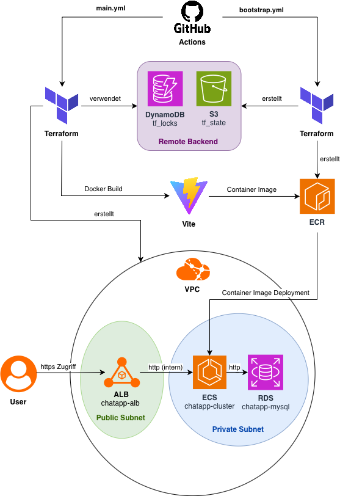

# DB Chat Application – Serviceportal für Benutzerkonten

## Projektübersicht

Dieses Projekt ist eine **Webanwendung zur administrativen Verwaltung von Benutzerkonten in einer Datenbank mithilfe eines Chatbots**. Die Anwendung bietet eine Weboberfläche, über die sich Nutzer zunächst authentifizieren müssen. Anschließend können administrative Aufgaben – wie das Erstellen von Nutzern in der Datenbank – dialogbasiert über einen Chatbot durchgeführt werden.

Der Chatbot:

* führt Benutzer **schrittweise und benutzerfreundlich** durch Prozesse (z. B. Registrierung),
* **validiert Eingaben** der Nutzer,
* ist mit den **Charakteristika aller verfügbaren Kontomodelle** vertraut und beantwortet entsprechende Rückfragen.

---

## Technologiestack

### Anwendung

* **SvelteKit** für Frontend **und** Backend
* REST-API-Endpunkte angebundener **Service Provider**
  * **AWS**
  * **Azure**

### Cloud & DevOps

* **Amazon Web Services (AWS)** als Zielplattform
* **Infrastructure as Code (IaC)** mit **Terraform**
* **CI/CD** über **GitHub Actions**
* **Statische Code-Analyse & Security Scanning** über **GitHub CodeQL** und **SonarCloud**

---

## Projektkontext & Zielsetzung

Dieses Repository ist ein **Fork** des folgenden Projekts:

👉 [https://github.com/adrku24/azure-bot/](https://github.com/adrku24/azure-bot/)

Das ursprüngliche Projekt wurde im Rahmen des Hochschulfachs **„Fortgeschrittene Themen im Cloud Computing“** entwickelt und war primär auf das Deployment in **Azure** ausgelegt.

### Abgrenzung dieses Projekts

Das **aktuelle Projekt** ist eine **abgewandelte und erweiterte Version**, die gezielt:

* auf ein **Deployment in AWS** optimiert ist,
* die Anforderungen des **Master-Moduls „Cloud Computing“** erfüllt,
* als **Prototyp für studentische Zwecke** dient.

⚠️ **Wichtiger Hinweis:**

> Dieses Projekt ist **nicht für den produktiven Einsatz vorgesehen**. Es handelt sich um einen funktionalen Prototyp zu **Lehr- und Demonstrationszwecken**.

---

## Erfüllte Modulanforderungen

Das Projekt erfüllt die folgenden fachlichen und technischen Anforderungen:

* ✅ Einsatz von **mindestens 3–4 AWS-Diensten**
* ✅ **Eigenes VPC**
  * Public & Private Subnets
  * IPv6-ready
* ✅ **Installation und Verwaltung über IaC (Terraform)**
* ✅ Nutzung eines **Build-Tools** für das Projekt
* ✅ **Zwei Testphasen** mit Beispieltests
  * mindestens ein Test pro Testphase
* ✅ **CI/CD-Pipelines** (Build, Test, Deploy)
* ✅ **Statische Code-Analyse & Security Scanning**

---

## Infrastrukturaufbau

Die Cloud-Infrastruktur wird vollständig automatisiert mit **Terraform** erstellt und verwaltet.

Das folgende Architekturdiagramm beschreibt das Zusammenspiel aller eingesetzten **AWS-Dienste** und weiterer **relevater Dienste**:

---

## Deployment auf AWS

Eine detaillierte Schritt-für-Schritt-Anleitung für das Deployment auf AWS ist in einem separaten Markdown-Dokument beschrieben.

➡️ **Siehe:** [Deployment-Anleitung](deployment.md)

Dort werden unter anderem behandelt:

* Voraussetzungen
* Initiales Bootstrap der Infrastruktur
* Konfiguration von Terraform
* CI/CD-Ausführung
* Deployment der Anwendung

---

## Lizenz & Nutzung

Dieses Projekt dient ausschließlich **akademischen Zwecken** im Rahmen eines Masterstudiums.

* Keine Garantie auf Vollständigkeit oder Sicherheit
* Keine Haftung
* Keine produktive Nutzung vorgesehen